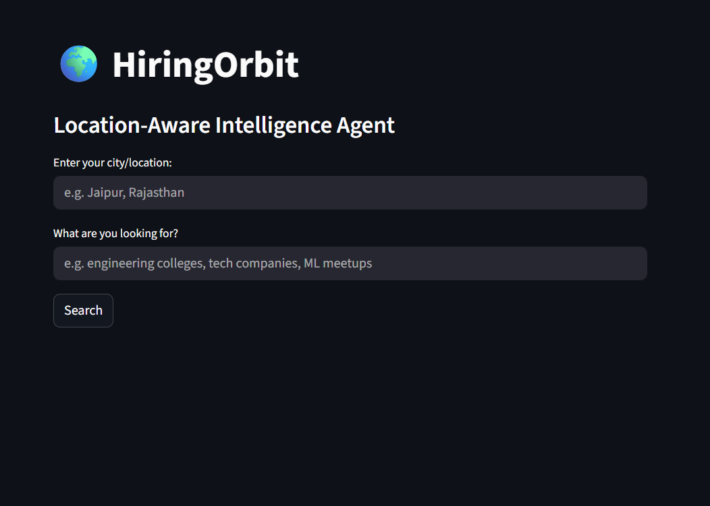
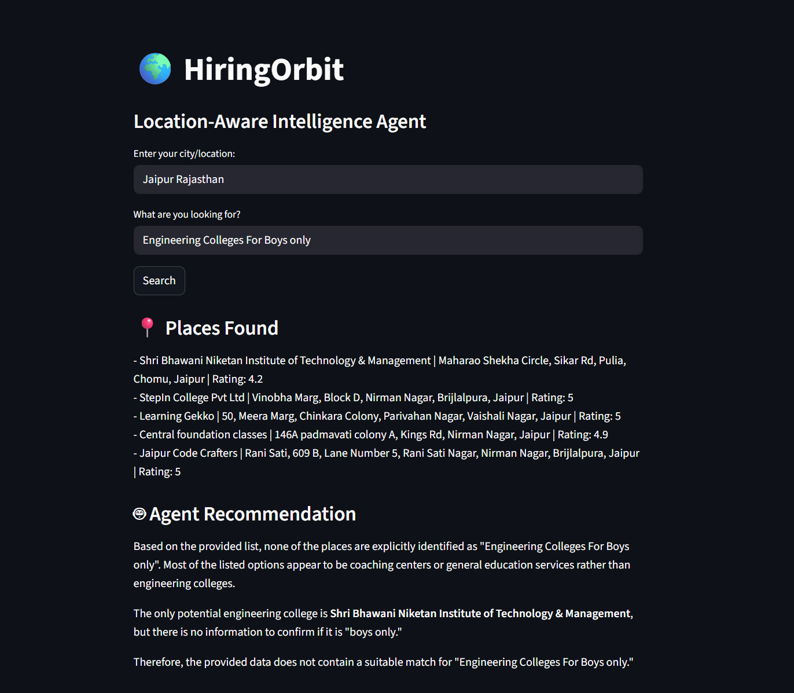
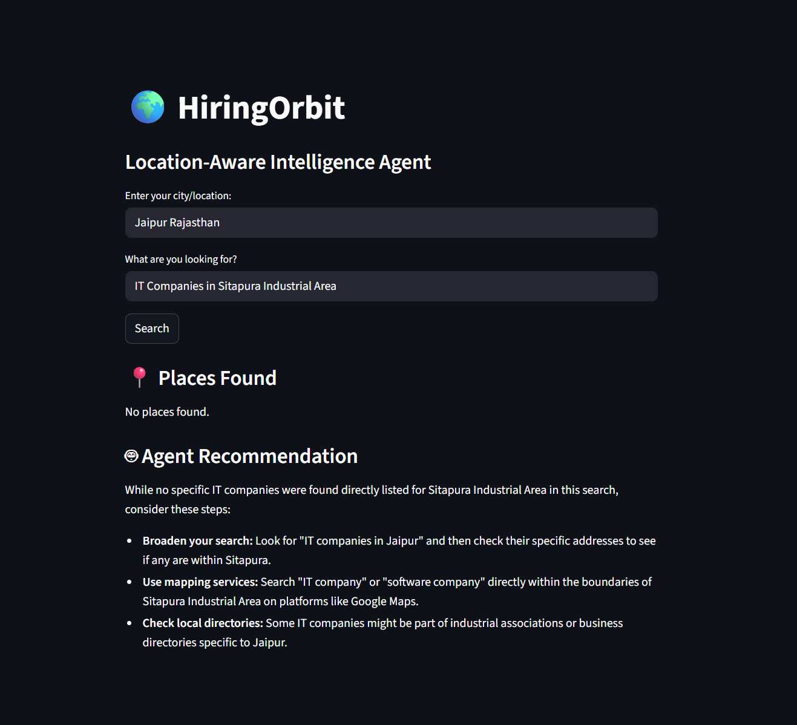

# 🌍 HiringOrbit
### Location-Aware Intelligence Agent

> Built as part of the **GFG x Google for Developers — Build with AI Series (Workshop 2)**

---

## 🧠 What Is HiringOrbit?

HiringOrbit is a location-aware intelligence agent that helps users find relevant places — engineering colleges, tech companies, ML communities, and more — near any city, powered by AI-driven recommendations.

You type a location and a query. The agent finds real nearby places using Google Maps and generates a smart, contextual recommendation using Gemini AI.

---

## 🏗️ What We Built (Phase 1 — MVP)

### The Problem
Finding relevant opportunities (colleges, companies, communities) near you usually means manually searching Google Maps, reading reviews, and piecing together information yourself. There's no intelligent layer that understands *why* you're searching and gives you a *recommendation*.

### The Solution
A simple but functional AI agent that:
- Takes a **natural language query** (e.g. "engineering colleges", "tech startups")
- Takes a **city/location** as input
- Fetches **real nearby places** using Google Maps + Places API
- Passes that data to **Gemini AI** which generates a smart, human-readable recommendation

### Tech Stack

| Layer | Technology | Purpose |
|-------|-----------|---------|
| AI/LLM | Google Gemini 2.5 Flash | Reasoning & recommendations |
| Location | Google Maps API + Places API | Fetching real nearby places |
| Geocoding | Google Geocoding API | Converting city name → coordinates |
| Frontend | Streamlit | Simple, fast UI |
| Config | python-dotenv | Secure API key management |
| Language | Python 3.14 | Core logic |

### Project Structure
```
hiringorbit/
├── agent.py          # Core logic: Maps API + Gemini AI
├── app.py            # Streamlit UI
├── requirements.txt  # Dependencies
├── .env              # API keys (not pushed to GitHub)
└── .gitignore        # Keeps .env secure
```

### How It Works
```
User enters city + query
        ↓
Geocoding API converts city → lat/lng coordinates
        ↓
Places API fetches top 5 nearby matching places
        ↓
Gemini AI receives places data + user query
        ↓
Gemini generates a contextual recommendation
        ↓
Streamlit displays results cleanly
```

---
## 📸 Screenshots

**Homepage**


**Search Results**


**Agent Handling No Results**

---
## ⚙️ How to Run Locally

### 1. Clone the repo
```bash
git clone https://github.com/yourusername/hiringorbit.git
cd hiringorbit
```

### 2. Install dependencies
```bash
pip install -r requirements.txt
```

### 3. Set up API keys
Create a `.env` file in the root folder:
```
GEMINI_API_KEY=your_gemini_api_key_here
MAPS_API_KEY=your_google_maps_api_key_here
```

**Get your keys:**
- Gemini API Key → [aistudio.google.com](https://aistudio.google.com)
- Maps API Key → [Google Cloud Console](https://console.cloud.google.com) (enable Maps JavaScript API, Places API, Geocoding API)

### 4. Run the app
```bash
python -m streamlit run app.py
```

---

## 🔭 What We're Building Next (Phase 2)

Phase 1 is a functional MVP. Phase 2 transforms it into a **true agentic system** — the original vision from the workshop.

### The Upgrade: ADK + MCP Architecture

| Component | Phase 1 (Now) | Phase 2 (Planned) |
|-----------|--------------|-------------------|
| AI Layer | Direct Gemini API call | Google ADK agent with reasoning loop |
| Tool Access | Hardcoded function calls | MCP servers as pluggable tools |
| Data | Maps API only | Maps API + BigQuery datasets |
| Intelligence | Single prompt | Multi-step agent reasoning |
| Memory | None | Conversation + preference memory |
| Frontend | Basic Streamlit | Full web app |

### Phase 2 Features Planned
- **ADK Agent** — The AI doesn't just respond, it *plans*: decides which tool to call, in what order, and why
- **MCP Servers** — Maps and BigQuery exposed as MCP-compliant tool servers the agent can plug into
- **BigQuery Integration** — Store and query structured datasets: company hiring data, salary ranges, location demographics
- **Placement Intelligence** — "Find ML companies hiring freshers within 200km of Jaipur with avg salary above 6 LPA"
- **Memory Layer** — Remember user preferences, past searches, and career goals across sessions
- **NeuraLog Integration** — Long-term: HiringOrbit's location intelligence layer feeds into NeuraLog, a personal context and memory assistant

---

## 📌 Why This Project?

This was built as part of a learning sprint to understand:
1. How AI agents connect to real-world data sources
2. How Google's Maps + Gemini APIs work together
3. The foundation of agentic architecture (tool-calling, context passing, reasoning)
4. How to ship a working project end-to-end — not just train models in a notebook

The goal isn't just a demo — it's a foundation for a production-grade career intelligence tool.

---

## 🛠️ Built With
- [Google Gemini API](https://aistudio.google.com)
- [Google Maps Platform](https://developers.google.com/maps)
- [Streamlit](https://streamlit.io)
- [python-dotenv](https://pypi.org/project/python-dotenv/)

---

## 👤 Author
**Ankush Poonia**
B.Tech AI/ML Engineering — Arya College of Engineering, Jaipur
[LinkedIn](https://github.com/ankush-poonia007/) | [GitHub](https://github.com/ankush-poonia007/)

---

*Phase 1 complete. Phase 2 in progress.*
